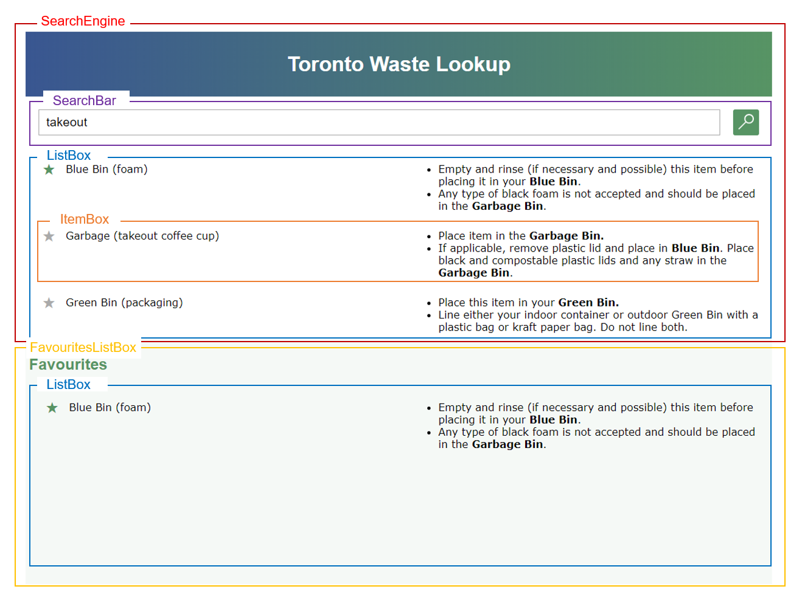

# Web Engineer Challenge - Summer 2019 - HuppeJ

The goal of this challenge was to build a web app to search for waste items using the Toronto Waste Wizard database, and save frequently used ones.

See it live: https://infallible-goldberg-47a8dc.netlify.com/

See also my free trial Shopify store (password=`"wisdom"`): https://a-piece-of-wisdom.myshopify.com/

## Getting Started

1 - Clone this repo with:

```sh
$ git clone git@github.com:HuppeJ/shopify-challenge-s19.git
```

2 - Install dependencies with:

```sh
$ npm install
```

3 - Start the project with:

```sh
$ npm start
```

4 - Open your favourite browser to: http://localhost:1234/

## Build

1 - Build the project using :

```sh
$ npm run build
```

## Built With
* [React](http://www.dropwizard.io/1.0.2/docs/) - User Interface library
* [Redux](https://maven.apache.org/) - State management library
* [Parcel](https://en.parceljs.org/) - Web application bundler

## Components Visualisation



## Tests

Due to time constraints, the tests have not been written yet. 

Here is a detailed plan of some important points to keep in mind when writing unit tests for each component.

### SearchEngine
* When `onSearch` method is called, when the `results` returned by the `queryTrigger` have not yet been returned, the `isSearching` state property should be true.
* After receiving the `results` from the `queryTrigger`, the `results` state property should be updated with the corresponding `results`.
* When `onEmptyInput` method is called, the `results` state property should set to empty.

### SearchBar
* When `onChange` method is called, the `value` state property should be updated to the input value.
* When `onChange` method is called, when the input value is an empty string, `this.props.onEmptyInput()` method should be called.
* When `onKeyDown` method is called, when the input value is `Enter`, `onSearch` method should be called.
* When `onSearch` method is called, when the `this.props.isSearching` is true, `this.props.onSearch()` method should not be called.
* When `onSearch` method is called, when the `this.props.isSearching` is false, `this.props.onSearch()` method should be called.
* When the button is clicked, the `onSearch` method should be called.

### ListBox
* When `getItems` method is called, when `this.props.items` is empty, it should return `this.props.noItemsMessage`.
* When `getItems` method is called, when `this.props.items`, it should return the corresponding array of `ItemBoxConnected` components.

### ItemBox
* When `componentWillReceiveProps` method is called, when the item is in `favouritedItems`, `isFavourited` state property should be set to true.
* When `componentWillReceiveProps` method is called, when the item is not in `favouritedItems`, `isFavourited` state property should be set to false.
* When `onStarClick` method is called, when `this.state.isFavourited` is true, when `this.props.favouritesCanBeRemoved` is true, `this.props.removeFavourite()` method should be called.
* When `onStarClick` method is called, when `this.state.isFavourited` is false, when `this.props.favouritesCanBeAdded` is true, `this.props.addFavourite()` method should be called.
* When a star is clicked, the `onStarClick` method should be called.

### FavouritesListBox
* When `componentWillReceiveProps` method is called, `items` state property should be updated with the corresponding `state.favouritedItems`.

### Redux
* Tests should also be added to make sure the redux store state is never mutated (See: `WasteLookupAppReducer`).
* Tests should also be added to make sure the Redux store state is properly updated when actions are dispatched (See: `FavouritesListBoxConnected`, `ItemBoxConnected`, `WasteLookupAppConnected`)

## Author
* **Jérémie Huppé** - [Github](https://github.com/HuppeJ)

